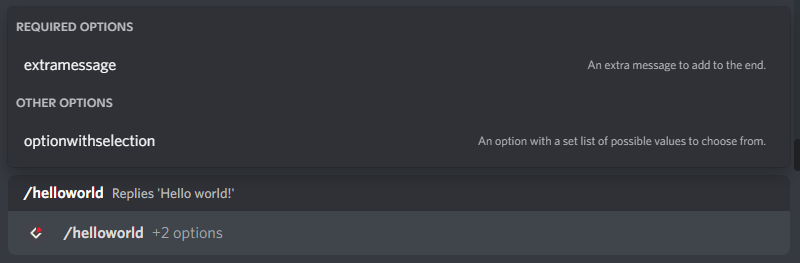
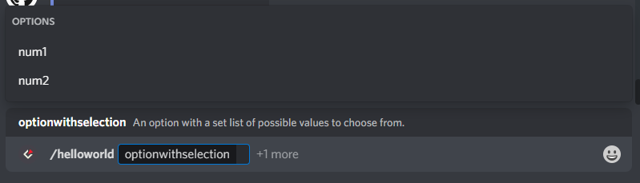
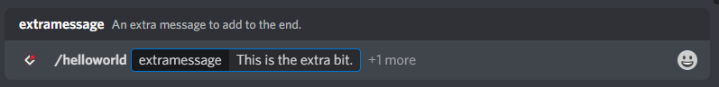
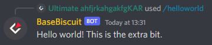
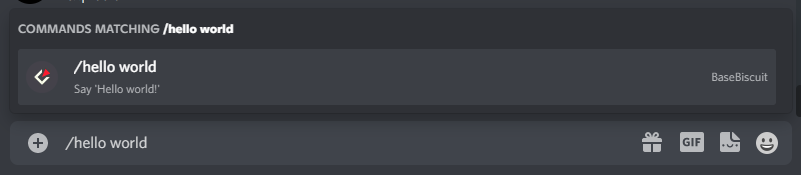
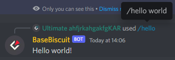
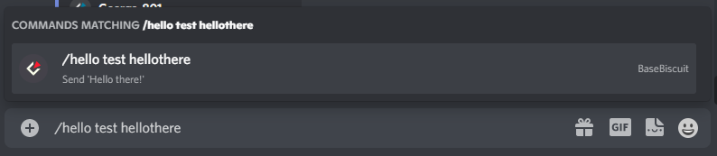
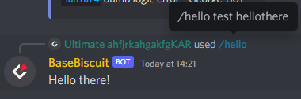

<h1 align="center"> BaseBiscuitv2</h1>

<div align="center">
    
    
    
    
    
</div>
<p align="center"><a href="https://emerildevs.github.io/BaseBiscuitv2/1.0.0/">Documentation</a> · <a href="https://github.com/EmerilDevs/BaseBiscuitv2/issues">Report bug</a> · <a href="https://github.com/EmerilDevs/BaseBiscuitv2/issues">Request feature</a></p>

## About
BaseBiscuitv2 is the second version of a Discord bot "base" off of which other Discord bots can be made with greater ease written by TechnoBiscuit. This version completely does away with legacy commands (messages with a set prefix) in favor of slash commands, facilitating both their normal use and features introduced more recently, such as localisation.

## Installation
**Node 16.9.0 or newer is required.**
1. Clone the repository. 
    ```shell
    git clone https://github.com/EmerilDevs/BaseBiscuitv2.git
    ```
2. Install dependencies.
   ```shell
   npm install
   ```
3. Set the Discord bot token - create a file named `.env` with the following contents:
   ```
   TOKEN=your bot token here
   ```
4. Choose settings in `src/config.js`:
    - Set `clientSettings.intents` to whichever set of Intents your bot requires.
    - Set `handlerSettings.logging.language` to the ISO 639-1 code of whichever language you want to log data in. (`en` is currently the only language supported, translations will be made available in the future)
    - Set `presence` to whatever you want your bot's presence to be. (see [here](https://discord.js.org/#/docs/discord.js/stable/typedef/PresenceData) for more information)
    - Set `errorChannel` to the ID of a channel to send error information to.
    - Add your Discord user ID to `ownerIDs` to pass all user permission checks.

## Usage
### Commands

#### Registration
BaseBiscuitv2 keeps a track of all registered commands in the `src/cache/` folder, and automatically re-registers commands to Discord whenever it detects a change on startup. Delete the `src/cache/` folder to force BaseBiscuitv2 to register all commands the next time it is activated.

#### Global/guild
Create global slash commands by creating files within `src/commands/global/`. Create guild-specific commands by creating files within `src/commands/guild/{guild ID}/`. For example, a command specific to a guild with the ID `123456789098765432` would be found in the folder `src/commands/guild/123456789098765432/`.

#### Name + execute


The most basic command file would include a command name and a function to execute when the command is called:
```js
// src/commands/global/helloworld.js

/** @type {import("../../types").Command} */
module.exports = {
    name: "helloworld",
    execute: interaction => {
        interaction.reply({ content: "Hello world!" });
    }
}
```
<div align="center"></div>
<div align="center"></div>

#### Description
A description can be added to the file as so:
```js
// src/commands/global/helloworld.js

/** @type {import("../../types").Command} */
module.exports = {
    name: "helloworld",
    description: "Replies 'Hello world!'",
    execute: interaction => {
        interaction.reply({ content: "Hello world!" });
    }
}
```
<div align="center"></div>

#### Permissions
Both bot and user permissions required to run a command can be added in the arrays `botPerms` and `userPerms` respectively. If no permissions are required, the arrays can be deleted. The bot will check that both the user running the command and the bot itself have the listed permissions before running the command's execute function when called (see [here](https://discord.js.org/#/docs/discord.js/stable/class/Permissions?scrollTo=s-FLAGS) for a list of permissions):
```js
// src/commands/global/helloworld.js

/** @type {import("../../types").Command} */
module.exports = {
    name: "helloworld",
    description: "Replies 'Hello world!'",
    botPerms: [
        "MANAGE_CHANNELS"
    ],
    userPerms: [
        "KICK_MEMBERS"
    ],
    execute: interaction => {
        interaction.reply({ content: "Hello world!" });
    }
}
```

#### Options
Command options can be added in the array `options` as follows:
```js
// src/commands/global/helloworld.js

const { CommandOptionTypes } = require("../../types");

/** @type {import("../../types").Command} */
module.exports = {
    name: "helloworld",
    description: "Replies 'Hello world!'",
    options: [
        {
            name: "extramessage",
            description: "An extra message to add to the end.",
            type: CommandOptionTypes.STRING,
            required: true
        },
        {
            name: "optionwithselection",
            description: "An option with a set list of possible values to choose from.",
            type: CommandOptionTypes.STRING,
            choices: [
                {
                    name: "num1",
                    value: "this one"
                },
                {
                    name: "num2",
                    value: "or this one"
                }
            ]
        }
    ],
    execute: interaction => {
        interaction.reply({ content: "Hello world!" });
    }
}
```
<div align="center"></div>
<div align="center"></div>

The values of options provided by users can then be obtained in the normal Discord.js manner:
```js
execute: interaction => {
    interaction.reply({ content: `Hello world! ${interaction.options?.getString("extramessage")}` });
}
```
<div align="center"></div>
<div align="center"></div>

#### Command settings
##### `allowInDMs`
All commands are deactivated in DMs by default. To allow a command to work in DMs, set `options.allowInDMs` to `true`:
```js
// src/commands/global/helloworld.js

/** @type {import("../../types").Command} */
module.exports = {
    name: "helloworld",
    description: "Replies 'Hello world!'",
    settings: {
        allowInDMs: true
    },
    execute: interaction => {
        interaction.reply({ content: "Hello world!" });
    }
}
```

#### Subcommands
Subcommands can be placed in a folder of the same name as the main command within the normal command folder. It is important to note that **the folder does not need to have the same name as the command file, but instead the same name as the actual command (as in the `name` property).** For example, say there was a command with the name `hello` within `src/commands/global/`. Any command files found under `src/commands/global/hello` would then become subcommands of `/hello`:
```txt
src/
└ commands/
  └ global/
    ├ hello.js
    └ hello/
      └ world.js
```
As the main commands of subcommands cannot be run, the files do not require an `execute` property, and instead just need a `name` and an optional `description`:
```js
// src/commands/global/hello.js

/** @type {import("../../types).Command} */
module.exports = {
    name: "hello",
    description: "Say hello."
}
```
Subcommands would then follow the same format as normal commands:
```js
// src/comamnds/global/hello/world.js

/** @type {import("../../../types").Command} */
module.exports = {
    name: "world",
    description: "Say 'Hello world!'",
    execute: interaction => {
        interaction.reply({ content: "Hello world!" });
    }
}
```
<div align="center"></div>
<div align="center"></div>

#### Subcommand groups
Subcommand groups can be created by creating a "group definition" within a subcommand folder. A group definition is a command file named `group.{group name}.js` containing just a name. Any commands that are part of that group will then be in files named in the format `{group name}.{command name}.js`. Any other command files within the subcommand folder without the name format `{group name}.{command name}.js` will be treated as regular subcomands:
```txt
src/
└ commands/
  └ global/
    ├ hello.js
    └ hello/
      ├ group.test.js
      └ test.hellothere.js
```
```js
// src/commands/global/hello/group.test.js

/** @type {import("../../../types").Command} */
module.exports = {
    name: "test"
}
```
```js
// src/commands/global/hello/test.hellothere.js

/** @type {import("../../../types").Command} */
module.exports = {
    name: "hellothere",
    description: "Send 'Hello there!'",
    execute: interaction => {
        interaction.reply({ content: "Hello there!" });
    }
}
```
<div align="center"></div>
<div align="center"></div>

### Events
Events can be created in `src/events`.
#### Event + execute
The most basic event file would include a [Discord event name](https://discord.js.org/#/docs/discord.js/stable/class/Client?scrollTo=e-apiRequest) and an execute function to call upon the event:
```js
// src/events/readyMessage.js

const { info } = require("../handlers/LoggingHandler"); 

/** @type {import("../types").Event} */
module.exports = {
    event: "shardReady",
    execute: () => {
        info("Shard ready!");
    }
}
```

#### Name
A name can be added to the event in order to make debugging easier. This name will be displayed in any console messages relating to the event:
```js
// src/events/readyMessage.js

const { info } = require("../handlers/LoggingHandler"); 

/** @type {import("../types").Event} */
module.exports = {
    name: "readyMessage",
    event: "shardReady",
    execute: () => {
        info("Shard ready!");
    }
}
```

#### Event settings
##### `debounce`
Debounce can be added to events in order to ensure they are only called once even if they are triggered multiple times in quick succession:
```js
// src/events/readyMessage.js

const { info } = require("../handlers/LoggingHandler"); 

/** @type {import("../types").Event} */
module.exports = {
    name: "readyMessage",
    event: "shardReady",
    settings: {
        debounce: {
            time: 1000,
            risingEdge: true
        }
    },
    execute: () => {
        info("Shard ready!");
    }
}
```

### Logging
There are 5 levels of log messages of increasing importance:
- **Debug**
  Used to send messages to the console for debugging.
- **Info**
  Used to log information about program activity.
- **Warn**
  Used to log undesirable yet non-fatal program activity.
- **Error**
  Used to log recoverable errors.
- **Critical**
  Used to log non-recoverable errors.

All logs will be visible in the console. Logs on levels between Info and Critical inclusive will be stored in a log file that will be able to be located in `logs/`. Any logs of level Error or Critical will be relayed to an "error channel" within Discord. The ID of this channel can be set within `src/config.js`.

All 5 logging functions are static functions of the `LoggingHandler` class and as such can be required straight into a file as so:
```js
const { debug, info, warn, error, critical } = require("./handlers/LoggingHandler");
```

### Database
Definitions of tables can be placed in `DatabaseHandler.#tableDefinitions` within `src/handlers/DatabaseHandler`. BaseBiscuitv2 will check these tables exist on startup, and create them if they don't. Operations can be carried out on the database through the static function `operation`:
```js
const { operation } = require("./handlers/DatabaseHandler");

let result = operation(db => db.prepare("SELECT * FROM users WHERE id = ?").get("123456789098765432"));
```
`operation` takes a function with one parameter, and passes the better-sqlite3 `Database` object in as a parameter. It then returns the result of the function. See [here](https://github.com/WiseLibs/better-sqlite3/blob/HEAD/docs/api.md) for more detail on how to use better-sqlite3.

### Localisation
One main feature BaseBiscuitv2 provides is language file support. It allows you to write your own language files and source text from them instead of hardcoding text into your bot in one language. Language files can be found under `src/lang/`. The format of a language file is as follows:
```text
# This is a comment
--- This is a header (acts same as comment) ---
path.to.follow=Actual text
```
Download the syntax highlighting extension for VSCode [here](https://github.com/George-801/basebiscuit-lang-file-extension) and place it in your VSCode extensions folder for ease of editing and using language files.

Custom text can be added to language files for use within your own code. To get a piece of text, use the static `getLocalisation` function from the `LanguageHandler` class:
```js
const { getLocalisation } = require("./handlers/LanguageHandler");
```
`getLocalisation` has two required parameters: firstly, the language code of the file to get the localised text from. This will be the language file's name without the extension `.lang`. For example, the default English language file that's provided with BaseBiscuitv2 would be `en`. It then takes an array of strings that represent the path to a localisation. For example:
```text
# src/lang/en.lang
commands.global.test.text=Random piece of text.
```
```js
// Prints "Random piece of text."
console.log(getLocalisation("en", ["commands", "global", "test", "text"]));
```
Localisations can also include strings to replace with content at runtime. Mark a string to replace by entering a number surrounded by curly brackets and a dollar sign. Each argument of `getLocalisation` after the path will then replace the string in the localisation respective to its position after the path:
```text
# src/lang/en.lang
commands.global.test.text=Random ${0} piece of ${1} text. ${0}
```
```js
// Prints "Random test piece of hello text. test"
console.log(getLocalisation("en", ["commands", "global", "test", "text"], "test", "hello"));
```
Discord now also allows slash commands to have localised names, descriptions, and options. You can set the locale to register a language file's localisations as by setting `meta.apiLocale` somewhere within the file. Have a look [here](https://discord.com/developers/docs/interactions/application-commands#localization) for a list of locales the Discord API currently supports. You can set localised versions of commands' names, descriptions and options through the use of the following format within a language file:
```text
# Global commands (commandName refers to the name property within the command file)
commands.global.commandName.name=Localised global command name
commands.global.commandName.description=Localised global command description

# Global command options (optionName refers to the name property of the option within the command file)
commands.options.global.commandName.optionName.name=Localised global command option name
commands.options.global.commandName.optionName.description=Localised global command option description

# Guild specific commands
commands.guild.commandName.name=Localised guild specific command name
commands.guild.commandName.description=Localised guild specific command description

# Guild specific command options
commands.options.global.commandName.optionName.name=Localised guild specific command option name
commands.options.global.commandName.optionName.description=Localised guild specific command option description
```

## Notice
The majority of this was written in four consecutive days, so bugs are quite likely. Please report any that you find [here](https://github.com/EmerilDevs/BaseBiscuitv2/issues).

Attribution would be very much welcome but is not strictly required in order for you to use this project.