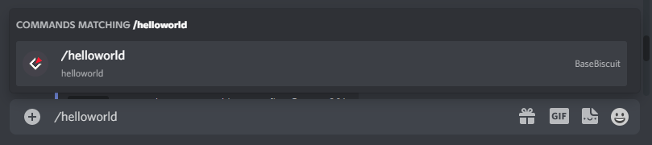
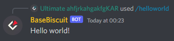
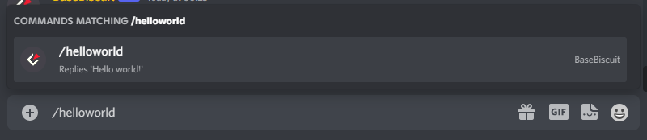

<h1 align="center"> BaseBiscuitv2</h1>

<div align="center">
    
    
    
    
    
</div>
<p align="center"><a href="https://emerildevs.github.io/BaseBiscuitv2/1.0.0/">Documentation</a> · <a href="https://github.com/EmerilDevs/BaseBiscuitv2/issues">Report Bug</a></p>

## About
BaseBiscuitv2 is the second version of a Discord bot "base" off of which other Discord bots can be made with greater ease written by TechnoBiscuit. This version completely does away with legacy commands (messages with a set prefix) in favor of slash commands, facilitating both their normal use and features introduced more recently, such as localisation.

## Installation
**Node 16.9.0 or newer is required.**
1. Clone the repository. 
    ```shell
    git clone https://github.com/EmerilDevs/BaseBiscuitv2.git
    ```
2. Install dependencies.
   ```shell
   npm install
   ```
3. Set the Discord bot token - create a file named `.env` within `src/` with the following contents:
   ```
   TOKEN=your bot token here
   ```
4. Choose settings in `src/config.js`:
    - Set `clientSettings.intents` to whichever set of Intents your bot requires.
    - Set `handlerSettings.logging.language` to the ISO 639-1 code of whichever language you want to log data in. (`en` is currently the only language supported, translations will be made available in the future)
    - Set `presence` to whatever you want your bot's presence to be. (see [here](https://discord.js.org/#/docs/discord.js/stable/typedef/PresenceData) for more information)
    - Set `errorChannel` to the ID of a channel to send error information to.
    - Add your Discord user ID to `ownerIDs` to pass all user permission checks.

## Usage
#### Commands
Create global slash commands by creating files within `src/commands/global/`. Create guild-specific commands by creating files within `src/commands/guild/{guild ID}/`. For example, a command specific to a guild with the ID `123456789098765432` would be found in the folder `src/commands/guild/123456789098765432/`.

The most basic command file would include a command name and a function to execute when the command is called:
```js
// src/commands/global/helloworld.js

/** @type {import("../../types").Command} */
module.exports = {
    name: "helloworld",
    execute: interaction => {
        interaction.reply({ content: "Hello world!" });
    }
}
```
<div align="center"></div>
<div align="center"></div>

A description can be added to the file as so:
```js
// src/commands/global/helloworld.js

/** @type {import("../../types").Command} */
module.exports = {
    name: "helloworld",
    description: "Replies 'Hello world!'",
    execute: interaction => {
        interaction.reply({ content: "Hello world!" });
    }
}
```
<div align="center"></div>

Both bot and user permissions required to run a command can be added in the arrays `botPerms` and `userPerms` respectively. The bot will check that both the user running the command and the bot itself have the listed permissions before running the command's execute function when called (see [here](https://discord.js.org/#/docs/discord.js/stable/class/Permissions?scrollTo=s-FLAGS) for a list of permissions):
```js
// src/commands/global/helloworld.js

/** @type {import("../../types").Command} */
module.exports = {
    name: "helloworld",
    description: "Replies 'Hello world!'",
    botPerms: [
        "MANAGE_CHANNELS"
    ],
    userPerms: [
        "KICK_MEMBERS"
    ],
    execute: interaction => {
        interaction.reply({ content: "Hello world!" });
    }
}
```

#### Events

#### Database

#### Localisation